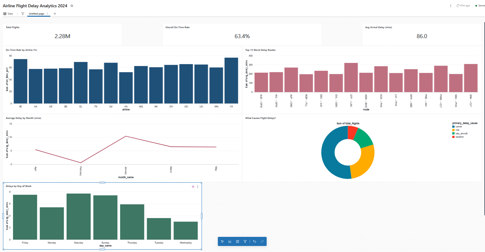
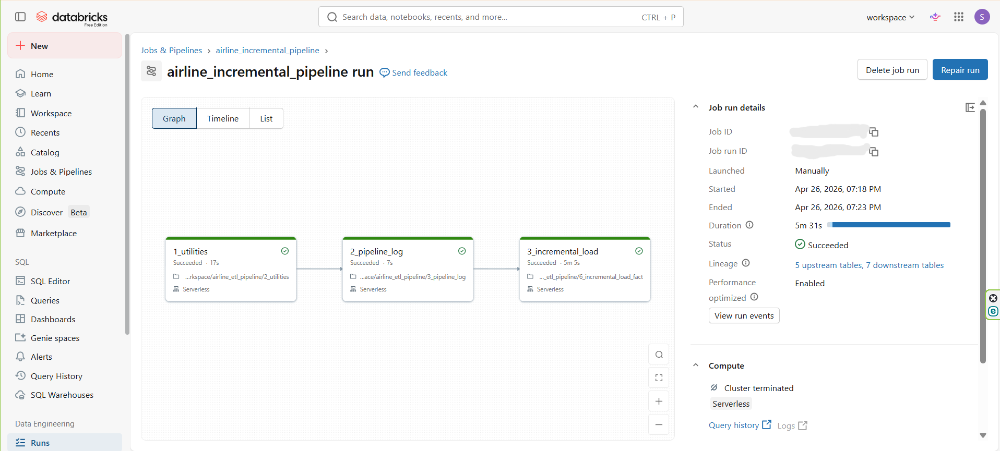
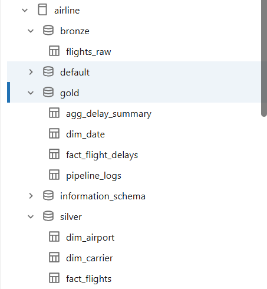
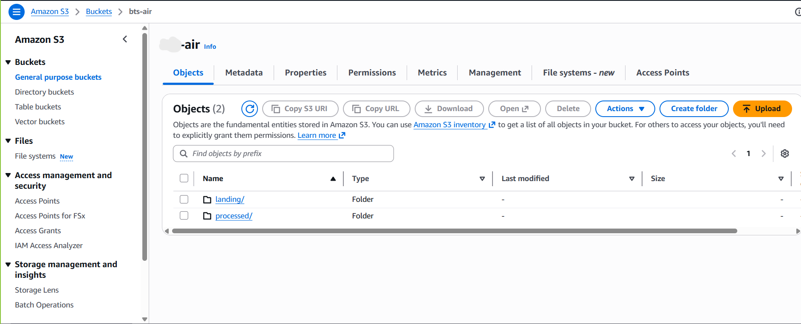

# ✈️ Airline Flight Delay ETL Pipeline

An end-to-end, production-grade data engineering pipeline that processes **2.28 million US flight records** using PySpark, Databricks, AWS S3, and Delta Lake — with automated daily incremental loads, pipeline observability, and a live analytics dashboard.

---

## 📊 Dashboard Preview



**Key insights from real BTS data (Jan–May 2024):**
- Only **63.4%** of US flights arrived on time
- **Carrier delays** are the #1 cause — not weather
- **Saturday** is the worst day to fly
- **January 2024** had the highest average delays

---

## 🏗️ Architecture

```
BTS On-Time Performance Data (Public Dataset)
                    │
                    ▼
         AWS S3 — Landing Zone
         s3://your-bucket/landing/flights/
                    │
                    ▼
┌─────────────────────────────────────────────────────┐
│                  BRONZE LAYER                        │
│         airline.bronze.flights_raw                   │
│  Raw ingestion · lineage columns · CDF enabled       │
└─────────────────────────────────────────────────────┘
                    │
                    ▼
┌─────────────────────────────────────────────────────┐
│                  SILVER LAYER                        │
│   airline.silver.fact_flights                        │
│   airline.silver.dim_carrier  (15 airlines)          │
│   airline.silver.dim_airport  (335 airports)         │
│  9-step cleaning · SHA-256 keys · upsert logic       │
└─────────────────────────────────────────────────────┘
                    │
                    ▼
┌─────────────────────────────────────────────────────┐
│                   GOLD LAYER                         │
│   airline.gold.fact_flight_delays                    │
│   airline.gold.agg_delay_summary                     │
│   airline.gold.dim_date  (366 days)                  │
│   airline.gold.pipeline_logs                         │
│  Window functions · pre-aggregation · dashboard      │
└─────────────────────────────────────────────────────┘
                    │
                    ▼
        Databricks Analytics Dashboard
```

---

## 🛠️ Tech Stack

| Tool | Purpose |
|---|---|
| **PySpark** | Data transformation and processing |
| **Databricks Free Edition** | Compute, orchestration, dashboard |
| **AWS S3** | Landing zone + processed file archive |
| **Delta Lake** | ACID transactions, CDF, merge/upsert |
| **Unity Catalog** | Data governance, table management |
| **Databricks Jobs** | Automated daily scheduling |
| **SQL** | Dashboard queries and verification |
| **Pandas** | Local CSV splitting (data prep) |

---

## 📁 Project Structure

```
airline-etl-pipeline/
│
├── README.md
│
├── notebooks/
│   ├── 1_setup_catalog.ipynb       ← creates catalog + schemas
│   ├── 2_utilities.ipynb           ← shared config for all notebooks
│   ├── 3_pipeline_log.ipynb        ← logging utility functions
│   ├── 4_dim_date_creation.ipynb   ← 366-day calendar dimension
│   ├── 5_full_load_fact.ipynb      ← historical backfill (Jan–Apr)
│   └── 6_incremental_load_fact.ipynb ← daily incremental loads
│
├── data_split/
│   └── split_daily_files.py        ← splits monthly CSVs into daily files
│
├── dashboard/
│       ├── on_time_by_airline.sql
│       ├── delay_cause_breakdown.sql
│       ├── monthly_delay_trend.sql
│       ├── worst_routes.sql
│       └── weekend_vs_weekday.sql
│
└── screenshots/
    ├── 1_databricks_job_run.png
    ├── 2_dashboard.png
    ├── 3_catalog_structure.png
    └── 4_s3_bucket.png
```

---

## 🗄️ Data Source

**BTS On-Time Reporting Carrier On-Time Performance**
- Source: [Bureau of Transportation Statistics](https://www.transtats.bts.gov/)
- Coverage: January – May 2024
- Records: 2,279,875 flights
- Airlines: 15 US carriers
- Airports: 335 US airports
- Download: Free public dataset, no account required

---

## ⚙️ Pipeline Features

### Full Load
- Downloads BTS monthly CSVs → splits into 121 daily files using pandas
- Ingests all files from S3 landing zone in one PySpark run
- Writes raw data to Bronze Delta table with lineage columns
- Applies 9-step Silver cleaning → creates dimension tables → builds Gold layer
- Moves all files from `landing/` to `processed/` after ingestion

### Incremental Load (Daily)
- New daily file drops into S3 `landing/flights/YYYY-MM-DD/`
- Staging table isolates today's ~17K rows (not full 2.4M)
- Only today's data flows through Silver and Gold
- Delta merge (upsert) on SHA-256 surrogate key — no duplicates ever
- Files archived to `processed/` after ingestion

### Data Quality (Silver Layer)
| Issue | Fix |
|---|---|
| 88.7% null delay cause columns | Filled with `0.0` |
| 99.9% null CancellationCode | Filled with `"N"` (not cancelled) |
| Impossible departure delays (< -120 mins) | Replaced with `null` |
| Duplicate flight records | Removed via `dropDuplicates()` |
| Raw string dates | Parsed to proper date type |

### New Columns Added in Silver
| Column | Values | Purpose |
|---|---|---|
| `flight_key` | SHA-256 hash | Surrogate key for upsert |
| `delay_bucket` | on_time / minor / moderate / severe | Dashboard filter |
| `primary_delay_cause` | weather / carrier / nas / late_aircraft / none | Dashboard chart |

### Gold Layer Optimizations
- **Window functions** — `row_number()` finds latest delay pattern per route
- **Pre-aggregated table** — dashboard queries scan 45K rows instead of 2.28M
- **Star schema joins** — fact table + 3 dimension tables for readable insights

---

## 🔭 Pipeline Observability

Every pipeline run writes one row to `airline.gold.pipeline_logs`:

```sql
SELECT * FROM airline.gold.pipeline_logs ORDER BY end_time DESC;
```

```
job_name              layer               rows_read   rows_written  status   duration
full_load_fact        bronze→silver→gold  2,240,444   2,279,875     success  ~15 mins
incremental_load_fact bronze→silver→gold  17,000      17,000        success  ~5 mins
incremental_load_fact bronze→silver→gold  17,000      17,000        success  ~5 mins
```

---

## 🤖 Automated Orchestration

Databricks Job: `airline_incremental_pipeline`

```
Task 1: 1_utilities        → loads shared config         (~17s)
        ↓
Task 2: 2_pipeline_log     → loads logging functions      (~7s)
        ↓
Task 3: 3_incremental_load → runs full incremental pipeline (~5m)
```

- Scheduled: daily at 2:00 AM
- Email alert: fires immediately on any task failure
- If Task 1 fails → Tasks 2 and 3 never run



---

## 💰 Cloud Cost Optimization

| Technique | Impact |
|---|---|
| Incremental staging tables | Process ~17K rows/day instead of re-scanning 2.4M |
| Pre-aggregated Gold layer | Dashboard queries 50x cheaper |
| Serverless compute | Zero idle cluster costs |
| S3 landing/processed pattern | No duplicate file ingestion |
| Incremental Gold recalculation | Only affected dates recalculated |

---

## 🗂️ Unity Catalog Structure



```
airline (catalog)
├── bronze
│   └── flights_raw          ← 2.28M rows, raw history
├── silver
│   ├── fact_flights          ← 2.28M rows, cleaned
│   ├── dim_carrier           ← 15 rows
│   └── dim_airport           ← 335 rows
└── gold
    ├── fact_flight_delays    ← 2.28M rows + is_latest_record
    ├── agg_delay_summary     ← 1.4M rows, pre-aggregated
    ├── dim_date              ← 366 rows, full 2024 calendar
    └── pipeline_logs         ← 1 row per pipeline run
```

---

## 🚀 How to Run

### Prerequisites
- Databricks Free Edition account
- AWS account with S3 bucket
- S3 External Location connected to Databricks via Unity Catalog

### Step 1 — Download data
```
https://www.transtats.bts.gov/PREZIP/On_Time_Reporting_Carrier_On_Time_Performance_1987_present_2024_1.zip
```
Download Jan–Apr 2024 (files `2024_1` through `2024_4`).

### Step 2 — Split into daily files
```bash
python data_split/split_daily_files.py
```
Creates `daily_splits/` folder with one CSV per day.

### Step 3 — Upload to S3
```bash
aws s3 cp daily_splits/ s3://your-bucket/landing/flights/ --recursive
```

### Step 4 — Configure utilities
In `2_utilities.ipynb`, update:
```python
BUCKET = "your-s3-bucket-name"
```

### Step 5 — Run notebooks in order
```
1_setup_catalog        ← run once
4_dim_date_creation    ← run once
5_full_load_fact       ← run once (full historical load)
6_incremental_load_fact ← run daily (new files only)
```

### Step 6 — Set up Databricks Job
Create job `airline_incremental_pipeline` with 3 tasks:
```
1_utilities → 2_pipeline_log → 3_incremental_load
```
Schedule daily at 2:00 AM. Add email notification on failure.

### Step 7 — Build dashboard
Run SQL queries in `dashboard/queries/` in Databricks SQL Editor.
Create visualizations using the Databricks Dashboard builder.

---

## 📈 Dashboard


**Charts included:**
- On-Time Rate by Airline (bar chart)
- Average Delay by Month (line chart)
- Top 15 Worst Delay Routes (bar chart)
- What Causes Flight Delays (pie chart)
- Delays by Day of Week (bar chart)
- KPI cards: Total Flights · On-Time Rate · Avg Arrival Delay

---

## ☁️ AWS S3 Structure



```
s3://your-bucket/
├── landing/flights/
│   └── YYYY-MM-DD/
│       └── flights_YYYY-MM-DD.csv   ← new files drop here daily
└── processed/flights/
    └── YYYY-MM-DD/
        └── flights_YYYY-MM-DD.csv   ← archived after ingestion
```

---

## 📌 Industry Best Practices Implemented

- ✅ Medallion Architecture (Bronze → Silver → Gold)
- ✅ Star Schema data modeling
- ✅ Delta Lake ACID transactions
- ✅ Change Data Feed (CDF) enabled
- ✅ SCD Type 1 dimension updates
- ✅ SHA-256 surrogate key generation
- ✅ Upsert (merge) logic — no duplicates
- ✅ Schema enforcement (Bronze) + Schema evolution (Silver)
- ✅ Staging table incremental pattern
- ✅ Pipeline observability via queryable logs table
- ✅ Automated orchestration with task dependencies
- ✅ Email alerting on failure
- ✅ Landing → Processed archive pattern
- ✅ Cloud cost optimization

---

*Data source: Bureau of Transportation Statistics (BTS) — public domain*
